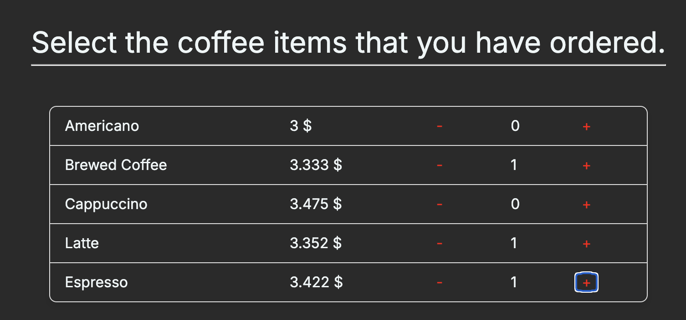

# # Solana Fellowship Program 2024 - Module 6 - Solana Pay

Build a Point-Of-Sale Web UI for adding products and checking out with Solana Pay. The payment confirmation should be displayed after checkout.

## Step to run the project

1. Clone the repository
2. Run `pnpm install`
3. Run `pnpm run dev`

4. Open [http://localhost:3000](http://localhost:3000)

## Step 1 - Select orders

## Step 2 - Automatically calculated price in SOL ( convert USD to SOL)

## Step 3 - Generate the Payment QR

## References 
https://github.com/Laugharne/ssf_s6_exo

